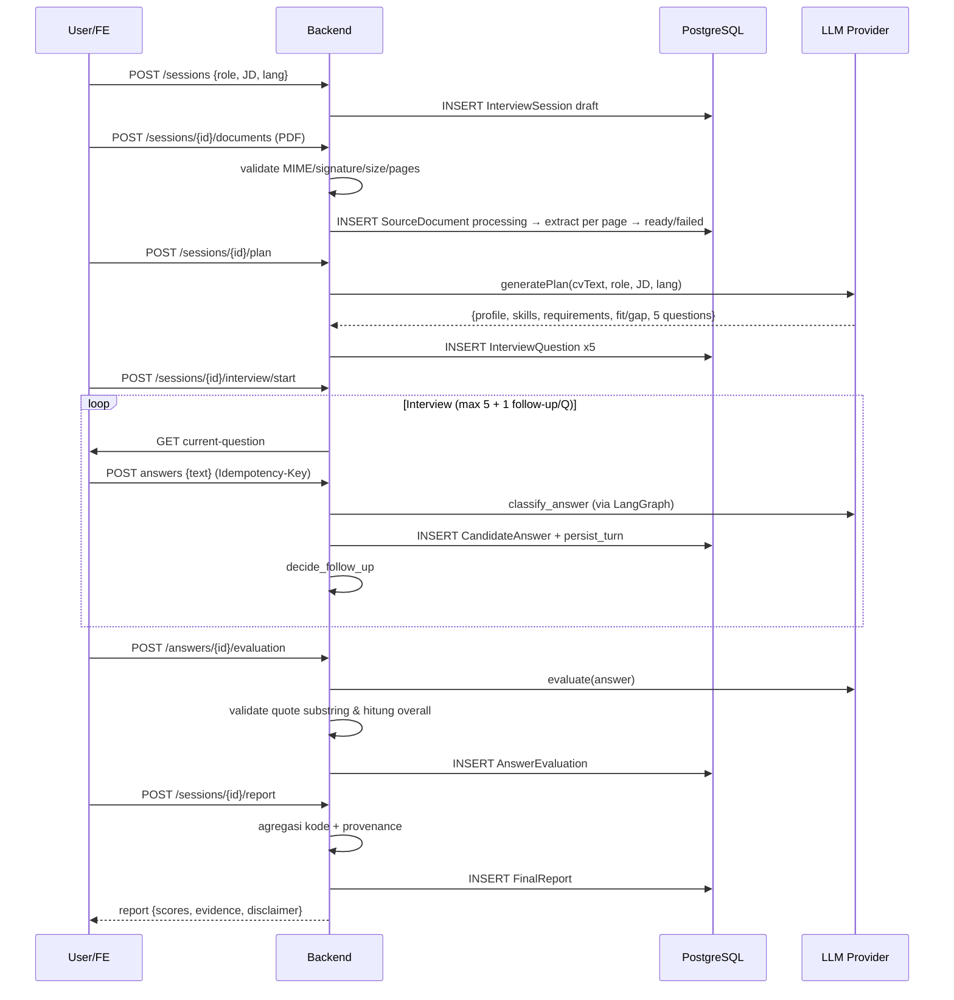

# ARCHITECTURE — AI Interviewer

> Stage 0 — desain saja; tidak ada implementasi fitur.

## 1. Batas Tanggung Jawab

| Komponen | Tanggung Jawab | Tidak Mengurus |
|---|---|---|
| **Frontend** `apps/web` (Next.js App Router + TS + Tailwind) | Render Home/daftar sesi, Setup (upload + form), Interview Room (1 pertanyaan aktif, progress, follow-up), Result Page; typed API client; loading/empty/error/retry/disabled state; cegah double submit; keyboard a11y; **tidak** menyimpan CV/API key di localStorage | Business logic scoring, agregasi report, klasifikasi jawaban |
| **Backend** `apps/api` (FastAPI + Pydantic + Python 3.12) | REST API, validasi request, orkestrasi service/repository, validasi MIME/signature/size/page-count PDF, ekstraksi teks per halaman, persistensi via SQLAlchemy, idempotency, rate limit, timeout/retry, sanitasi error, CORS, correlation ID | Rendering UI, inference LLM langsung (lewat provider interface) |
| **Agent** (LangGraph) | Workflow interview teks: `load_session → select_question → wait_for_answer → classify_answer → decide_follow_up → persist_turn → advance_or_finish`; state recovery dari DB; batas 5 utama + 1 follow-up/pertanyaan; tidak menilai final | Evaluation, STT/TTS, avatar |
| **Provider AI** | Interface `LLMProvider` + `StubLLMProvider` (deterministik untuk test) + `OpenCodeProvider` (adapter HTTP ke `opencode serve`); session terisolasi, tools dimatikan, minta JSON terstruktur, timeout, cleanup; validasi Pydantic semua output model | Pemanggilan OpenCode tersebar — hanya via adapter |
| **Database** (PostgreSQL + SQLAlchemy 2 + Alembic, Docker Compose) | Tabel session/document/question/answer/evaluation/report; UUID PK, timestamp UTC, FK, constraint, enum status; migration terisolasi | Embeddings/RAG di MVP |
| **Observability** | Structured logging, correlation ID, trace LangGraph & provider, Langfuse opsional via env (Stage 9); tidak log CV/JD/jawaban lengkap/token/secret | — |

Keputusan audit: repo baru tanpa scaffold — struktur `apps/web`, `apps/api`, `packages/contracts`, `infra/docker-compose.yml` baru dibuat di Stage 1.

## 2. Alur Data (Upload CV → Laporan Akhir)

```
User → Frontend → Backend → DB / Provider → kembali ke Frontend
```

Langkah rinci:
1. `POST /api/sessions` → buat `InterviewSession(status=draft)`.
2. `POST /api/sessions/{id}/documents` (multipart PDF) → backend validasi (MIME, ekstensi, magic bytes `%PDF`, size, page count) → simpan file ke path aman (nama acak, bukan dari user) → ekstrak teks per halaman → isi `SourceDocument(status=ready, page_count, pages[]{page_no, text, char_count})` atau `failed`.
3. `POST /api/sessions/{id}/plan` → backend ambil teks CV + target_role + JD + language → panggil `LLMProvider.generatePlan()` → validasi Pydantic (5 pertanyaan, competency/objective wajib, skills hanya dari CV) → simpan `InterviewQuestion` x5 + ringkasan plan ke session.
4. `POST /api/sessions/{id}/interview/start` → inisialisasi LangGraph state (`status=in_progress`, `current_question_index=0`).
5. Loop interview: `GET .../current-question` → user `POST .../answers` (idempotent via `Idempotency-Key`) → `classify_answer` → `decide_follow_up` (maks 1/pertanyaan) → `persist_turn` → `advance_or_finish` → `GET .../current-question` berikutnya.
6. `POST .../interview/end` → `status=completed`.
7. Evaluasi: `POST /api/sessions/{id}/answers/{aid}/evaluation` → provider → validasi (skor 0–5, quote substring jawaban, overall hitung kode) → simpan `AnswerEvaluation`.
8. Report: `POST /api/sessions/{id}/report` → agregasi kode (rata-rata per dimensi/competency, overall transparan), kumpulkan provenance (question_id, answer_id, evaluation_id), model hanya merangkum — simpan `FinalReport`; `GET .../report` untuk buka kembali.

## 3. Diagram Mermaid

```mermaid
flowchart TB
  subgraph FE[Frontend - Next.js]
    Home[Home / Daftar Sesi]
    Setup[Setup: upload CV + role + JD + bahasa]
    Room[Interview Room: pertanyaan + jawaban + follow-up]
    Result[Result Page: skor + evidence + report]
  end

  subgraph BE[Backend - FastAPI]
    API[REST API + Validasi]
    Svc[Service / Repository Layer]
    LG[LangGraph Workflow]
    ProvIface[LLMProvider Interface]
  end

  subgraph Prov[Provider]
    Stub[StubLLMProvider]
    OC[OpenCodeProvider → opencode serve]
  end

  subgraph DB[(PostgreSQL)]
    Sess[(InterviewSession)]
    Doc[(SourceDocument)]
    Q[(InterviewQuestion)]
    Ans[(CandidateAnswer)]
    Eval[(AnswerEvaluation)]
    Rep[(FinalReport)]
  end

  Home --> API
  Setup -->|POST /sessions, /documents, /plan| API
  Room -->|/interview/*, /answers| API
  Result -->|/report, /evaluation| API
  API --> Svc --> DB
  Svc --> LG --> Svc
  Svc --> ProvIface --> Stub
  ProvIface --> OC
  LG -.-> ProvIface
  Svc -.-> ProvIface

  style OC fill:#1a1a2e,stroke:#4cc9f0,color:#fff
  style Stub fill:#2d4a22,stroke:#7ec850,color:#fff
```



## 4. Strategi Stub Provider

- Interface `LLMProvider` di `apps/api/app/providers/base.py` (contoh):
  `generatePlan(cvText, role, jd, lang) → Plan`, `classifyAnswer(...)`, `evaluateAnswer(...)`, `generateFollowUp(...)`.
- `StubLLMProvider`: deterministik, tanpa network/API key, mengembalikan data valid sesuai Pydantic schema; dipakai di `pytest` dan demo lokal. Test assert output invalid ditolak, bukan di-retry tak terbatas.
- `OpenCodeProvider`: satu-satunya tempat yang memanggil `opencode serve` HTTP API (bukan endpoint OpenAI `/v1/chat/completions`); baca `OPENCODE_BASE_URL`, `OPENCODE_MODEL`, `OPENCODE_SERVER_USERNAME/PASSWORD` dari env; buat session terisolasi, `tools=[]` (dimatikan), minta JSON terstruktur, `timeout` eksplisit, hapus session setelah selesai (`DELETE /sessions/{id}`). Perpindahan stub ↔ OpenCode tidak mengubah business logic.
- Validasi: semua respons provider divalidasi Pydantic; skor di luar 0–5, quote bukan substring, atau JSON rusak → retry terbatas lalu gagal tanpa simpan evaluasi sukses.

## 5. Dua Mode Runtime LLM

| Mode | Konfigurasi | Kapan Dipakai |
|---|---|---|
| **OpenCode lokal (loopback)** | `OPENCODE_BASE_URL=http://127.0.0.1:4096`, tanpa auth atau `OPENCODE_SERVER_USERNAME/PASSWORD` lokal | Development di mesin sendiri; `opencode serve` jalan di loopback |
| **OpenCode cloud terautentikasi** | `OPENCODE_BASE_URL=https://<host>:<port>` + `OPENCODE_SERVER_USERNAME` + `OPENCODE_SERVER_PASSWORD` (env only, tidak ke browser) | Staging/demo cloud; server OpenCode di-host terpisah, wajib TLS + auth |

Perpindahan mode **hanya via environment variable**, tanpa perubahan business logic, tanpa meneruskan URL/credential ke browser. Backend membedakan health: `GET /health` (aplikasi hidup) vs `GET /api/health/opencode` (OpenCode reachable, Stage 4). Jika mode cloud tanpa password diekspos ke internet → blocker, jangan deploy.

## 6. Error Handling & Idempotency Sederhana

- **Validasi**: Pydantic di boundary API; PDF: MIME + ekstensi + magic bytes + size + page count; nama file user tidak dipakai untuk path (UUID/nanoid).
- **Error sanitasi**: response client berisi `code`, `message` aman, `details` validasi; stack trace/path/secret tidak bocor; log server pakai correlation ID (`X-Request-ID`).
- **Status code**: 200/201 sukses, 400 validasi, 401/403 auth (Stage 9), 404 not found, 409 status transition invalid, 413 payload too large, 422 unprocessable (PDF parse), 429 rate limit (Stage 9), 500 internal (sanitized).
- **Idempotency**: `Idempotency-Key` header untuk `POST .../answers`, `POST .../plan`, `POST .../report`; backend dedup via unique constraint `(session_id, idempotency_key)` atau `(session_id, question_id, attempt)` → duplicate request kembalikan resource existing (200) tanpa gandakan turn/report.
- **Retry/timeout**: provider call timeout eksplisit (mis. 30s), retry terbatas (1–2x) untuk transient error; kegagalan provider tidak disimpan sebagai skor 0 kandidat (`needs_review`/`insufficient_answer`).
- **Rate limit & size limit**: Stage 9 — batasi ukuran request dan rate endpoint AI mahal.
- **Recovery**: semua state interview dipersist ke DB; restart backend → `load_session` pulihkan state.
