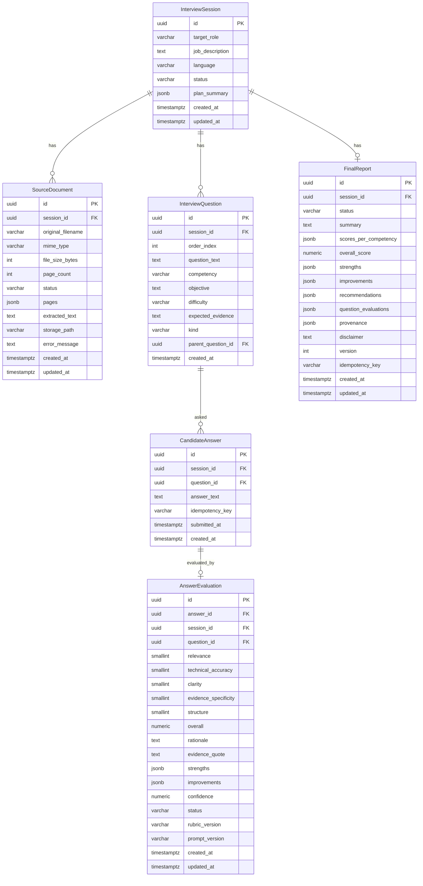

# DATA MODEL — AI Interviewer

> Stage 0 — desain saja. Implementasi tabel di Stage 2.

## 1. Konvensi Umum

- PK: `id UUID` (gen_random_uuid / app-generated UUID4), indexed.
- Timestamps: `created_at TIMESTAMPTZ NOT NULL DEFAULT now()`, `updated_at TIMESTAMPTZ NOT NULL` (trigger/app).
- Semua timestamp UTC; API serialisasi ISO 8601 `YYYY-MM-DDTHH:mm:ssZ`.
- Soft delete tidak dipakai MVP — `DELETE /sessions/{id}` hanya untuk `status=draft` (hard delete); selain itu ditolak 409.
- Foreign key `ON DELETE CASCADE` hanya dari session ke children; antar child `ON DELETE RESTRICT` untuk jaga provenance.
- Enum disimpan sebagai `VARCHAR` + CHECK atau native PG enum (keputusan Stage 2); status transition divalidasi di service layer.
- Idempotency: `idempotency_key VARCHAR(64)` nullable, unique per scope; index `UNIQUE(session_id, idempotency_key)` di tabel yang butuh.

## 2. ER Diagram (Mermaid)



## 3. Entitas Minimum

### 3.1 InterviewSession

Represents one latihan interview end-to-end.

| Kolom | Tipe | Constraint | Keterangan |
|---|---|---|---|
| `id` | UUID | PK | |
| `target_role` | VARCHAR(200) | NOT NULL | Role yang dilamar |
| `job_description` | TEXT | NOT NULL | JD mentah |
| `language` | VARCHAR(10) | NOT NULL, CHECK IN ('id','en') | Bahasa interview |
| `status` | VARCHAR(20) | NOT NULL, CHECK IN ('draft','ready','in_progress','completed','abandoned') | State machine: `draft → ready → in_progress → completed`; `draft→abandoned`, `in_progress→abandoned` |
| `plan_summary` | JSONB | NULL | Ringkasan profil, skills CV, requirements JD, fit/gap (diisi setelah generate plan) |
| `current_question_index` | INT | NOT NULL DEFAULT 0 | Untuk recovery LangGraph |
| `created_at` | TIMESTAMPTZ | NOT NULL | |
| `updated_at` | TIMESTAMPTZ | NOT NULL | |

Indexes: `idx_session_status`, `idx_session_created_at DESC` untuk daftar terbaru.

### 3.2 SourceDocument

Satu CV PDF per session (MVP).

| Kolom | Tipe | Constraint | Keterangan |
|---|---|---|---|
| `id` | UUID | PK | |
| `session_id` | UUID | FK → InterviewSession.id, UNIQUE(session_id) | Satu dokumen per session |
| `original_filename` | VARCHAR(255) | NOT NULL | Hanya untuk display, tidak dipakai untuk path |
| `mime_type` | VARCHAR(100) | NOT NULL | Harus `application/pdf` |
| `file_size_bytes` | INT | NOT NULL, CHECK >0 | Validasi batas (mis. 5 MB) |
| `page_count` | INT | NOT NULL | Validasi batas (mis. 10 halaman) |
| `status` | VARCHAR(20) | NOT NULL, CHECK IN ('uploaded','processing','ready','failed') | |
| `pages` | JSONB | NOT NULL DEFAULT '[]' | `[{page_no, text, char_count}]` untuk evidence traceability |
| `extracted_text` | TEXT | NULL | Gabungan teks semua halaman |
| `storage_path` | VARCHAR(500) | NOT NULL | Path aman (UUID-based), bukan dari user input |
| `error_message` | TEXT | NULL | Pesan aman untuk client |
| `created_at` | TIMESTAMPTZ | NOT NULL | |
| `updated_at` | TIMESTAMPTZ | NOT NULL | |

### 3.3 InterviewQuestion

Pertanyaan utama + follow-up.

| Kolom | Tipe | Constraint | Keterangan |
|---|---|---|---|
| `id` | UUID | PK | |
| `session_id` | UUID | FK → InterviewSession.id | |
| `order_index` | INT | NOT NULL, CHECK 0–4 untuk kind=main | Urutan tampil |
| `question_text` | TEXT | NOT NULL | |
| `competency` | VARCHAR(100) | NOT NULL | Mis. `problem_solving`, `system_design` |
| `objective` | TEXT | NOT NULL | Tujuan pertanyaan |
| `difficulty` | VARCHAR(20) | NOT NULL, CHECK IN ('easy','medium','hard') | |
| `expected_evidence` | TEXT | NOT NULL | Apa yang diharapkan dari jawaban |
| `kind` | VARCHAR(20) | NOT NULL, CHECK IN ('main','follow_up') | |
| `parent_question_id` | UUID | NULL, FK → InterviewQuestion.id | NULL untuk main; isi untuk follow-up |
| `created_at` | TIMESTAMPTZ | NOT NULL | |

Constraints: `UNIQUE(session_id, order_index) WHERE kind='main'`; `UNIQUE(parent_question_id)` untuk maks 1 follow-up per pertanyaan utama (enforced di service + partial unique index).

### 3.4 CandidateAnswer

Satu jawaban per pertanyaan (termasuk follow-up).

| Kolom | Tipe | Constraint | Keterangan |
|---|---|---|---|
| `id` | UUID | PK | |
| `session_id` | UUID | FK → InterviewSession.id | |
| `question_id` | UUID | FK → InterviewQuestion.id | |
| `answer_text` | TEXT | NOT NULL, CHECK length >0 | |
| `idempotency_key` | VARCHAR(64) | NULL | Untuk dedup double submit |
| `submitted_at` | TIMESTAMPTZ | NOT NULL | |
| `created_at` | TIMESTAMPTZ | NOT NULL | |

Index: `UNIQUE(session_id, question_id)` — satu jawaban per pertanyaan; `UNIQUE(session_id, idempotency_key)` untuk idempotency.

### 3.5 AnswerEvaluation

Hasil penilaian per jawaban.

| Kolom | Tipe | Constraint | Keterangan |
|---|---|---|---|
| `id` | UUID | PK | |
| `answer_id` | UUID | FK → CandidateAnswer.id, UNIQUE | Satu evaluasi per jawaban (versioning via update, bukan duplikat) |
| `session_id` | UUID | FK → InterviewSession.id | Denormalisasi untuk query cepat |
| `question_id` | UUID | FK → InterviewQuestion.id | |
| `relevance` | SMALLINT | NOT NULL, CHECK 0–5 | |
| `technical_accuracy` | SMALLINT | NOT NULL, CHECK 0–5 | |
| `clarity` | SMALLINT | NOT NULL, CHECK 0–5 | |
| `evidence_specificity` | SMALLINT | NOT NULL, CHECK 0–5 | |
| `structure` | SMALLINT | NOT NULL, CHECK 0–5 | |
| `overall` | NUMERIC(3,2) | NOT NULL, CHECK 0–5 | Dihitung kode: mis. `mean(5 dimensi)` atau bobot terdokumentasi; bukan dari model |
| `rationale` | TEXT | NOT NULL | Alasan singkat |
| `evidence_quote` | TEXT | NOT NULL | Harus substring dari `CandidateAnswer.answer_text` (validasi app) |
| `strengths` | JSONB | NOT NULL | `string[]` |
| `improvements` | JSONB | NOT NULL | `string[]` |
| `confidence` | NUMERIC(3,2) | NOT NULL, CHECK 0–1 | |
| `status` | VARCHAR(20) | NOT NULL, CHECK IN ('evaluated','needs_review','insufficient_answer') | |
| `rubric_version` | VARCHAR(20) | NOT NULL | Mis. `v1.0` |
| `prompt_version` | VARCHAR(20) | NOT NULL | Untuk audit |
| `created_at` | TIMESTAMPTZ | NOT NULL | |
| `updated_at` | TIMESTAMPTZ | NOT NULL | |

Validasi penting: `evidence_quote` harus `answer_text CONTAINS evidence_quote` (case-sensitive substring); jika gagal → status bukan `evaluated`.

### 3.6 FinalReport

Agregat akhir per session.

| Kolom | Tipe | Constraint | Keterangan |
|---|---|---|---|
| `id` | UUID | PK | |
| `session_id` | UUID | FK → InterviewSession.id, UNIQUE | Satu report per session (versioning via `version`) |
| `status` | VARCHAR(20) | NOT NULL, CHECK IN ('complete','incomplete') | `incomplete` jika evaluasi belum lengkap |
| `summary` | TEXT | NOT NULL | Ringkasan dari evaluasi tervalidasi (model hanya merangkum) |
| `scores_per_competency` | JSONB | NOT NULL | `{"competency": avg_score}` — agregasi kode |
| `overall_score` | NUMERIC(3,2) | NOT NULL | Agregasi kode transparan |
| `strengths` | JSONB | NOT NULL | Agregat dari evaluations |
| `improvements` | JSONB | NOT NULL | Top 3 |
| `recommendations` | JSONB | NOT NULL | Rekomendasi latihan |
| `question_evaluations` | JSONB | NOT NULL | Array per Q/A/Eval untuk display |
| `provenance` | JSONB | NOT NULL | `{question_ids, answer_ids, evaluation_ids, rubric_version}` |
| `disclaimer` | TEXT | NOT NULL | "Laporan adalah alat latihan, bukan keputusan hiring." |
| `version` | INT | NOT NULL DEFAULT 1 | Increment saat regenerate |
| `idempotency_key` | VARCHAR(64) | NULL | |
| `created_at` | TIMESTAMPTZ | NOT NULL | |
| `updated_at` | TIMESTAMPTZ | NOT NULL | |

Index: `UNIQUE(session_id, version)`, `UNIQUE(session_id, idempotency_key)`.

## 4. Contoh Payload JSONB

`SourceDocument.pages`:
```json
[{"page_no": 1, "text": "John Doe ...", "char_count": 1234}]
```

`AnswerEvaluation.strengths`:
```json
["Memberi contoh metrik latency yang konkret"]
```

## 5. Relasi & Lifecycle

- `InterviewSession` adalah aggregate root; semua entitas lain berelasi via `session_id`.
- Urutan creation: Session → SourceDocument → InterviewQuestion (plan) → CandidateAnswer (loop) → AnswerEvaluation → FinalReport.
- Status transition Session dijaga di service layer; DB constraint sebagai safety net.
